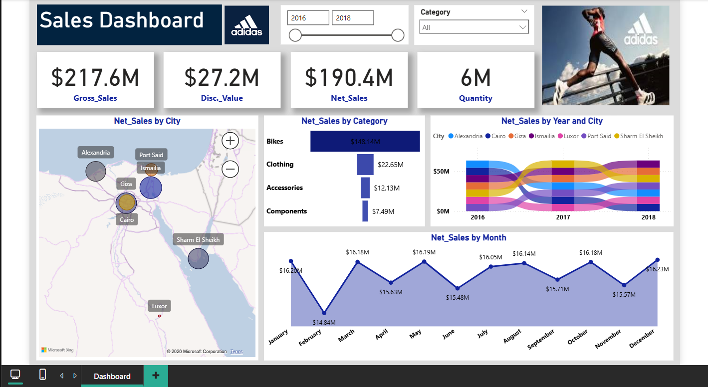

# 👟 Adidas Sales Dashboard

## 📌 Project Overview

This Power BI project analyzes **Adidas sales performance** across multiple dimensions including **time, geography, and product categories**.  
The dashboard is designed as a **one-page executive view** that enables stakeholders to quickly assess financial performance and identify trends.

The report covers sales data from **2016 to 2018** and focuses on delivering **clear, actionable business insights**.

---

## 🎯 Project Objectives

- Monitor overall sales performance using key financial KPIs  
- Analyze net sales across product categories  
- Explore geographic sales distribution across major cities  
- Identify seasonal sales trends over months and years  
- Provide an interactive, filter-driven decision-making tool  

---

## 📊 Dashboard Overview

The dashboard is built as a **single comprehensive page** combining multiple analytical perspectives.

---

### 🔍 Filters

- **Year Selector:** 2016 – 2018  
- **Category Selector:** All product categories  

These filters allow dynamic exploration of sales data across time and products.

---

### 📈 Key Performance Indicators (KPIs)

The top section highlights core financial metrics:

- **Gross Sales:** $217.6M  
- **Discount Value:** $27.2M  
- **Net Sales:** $190.4M  
- **Quantity Sold:** 6M units  

These KPIs provide an immediate snapshot of overall business performance.

---

### 🗺️ Net Sales by City (Map)

Visualizes net sales distribution across major cities:

- Alexandria  
- Cairo  
- Giza  
- Port Said  
- Ismailia  
- Luxor  
- Sharm El Sheikh  

This view helps identify **top-performing and underperforming regions**.

---

### 📦 Net Sales by Product Category (Bar Chart)

Highlights revenue contribution by category:

- **Bikes:** $148.14M  
- **Clothing:** $22.65M  
- **Accessories:** $12.13M  
- **Components:** $7.49M  

Clearly shows which product lines drive the majority of revenue.

---

### 🔁 Net Sales Flow by Year & City (Sankey Diagram)

Displays how net sales flow across:

- **Years:** 2016, 2017, 2018  
- **Cities:** Alexandria, Cairo, Giza, Ismailia, Luxor, Port Said, Sharm El Sheikh  

This visualization helps track **sales movement and growth patterns** over time and geography.

---

### 📆 Net Sales by Month (Line Chart)

Shows monthly sales trends to uncover seasonality:

- Sales remain relatively stable throughout the year  
- Slight peaks observed in **January, March, May, and December**  

This supports planning for inventory, promotions, and campaigns.

---

## 🖼️ Dashboard Screenshot

Preview of the dashboard design and layout:

*(High-resolution dashboard image is stored in the `assets/` folder)*

---

## 🧠 Insights & Recommendations

### 🔑 Key Insights
- Bikes dominate sales, contributing the majority of net revenue.  
- Sales performance is strongest in major cities like **Cairo and Alexandria**.  
- Monthly sales show consistent performance with mild seasonal fluctuations.  
- Discounts have a noticeable impact on reducing gross sales to net sales.  

### 💡 Recommendations
- Focus marketing and inventory efforts on **high-performing cities**.  
- Expand and optimize the **Bikes category**, as it drives most revenue.  
- Leverage seasonal peaks for targeted promotional campaigns.  
- Monitor discount strategies to balance volume growth and profitability.  

---

## 🛠 Skills & Techniques Demonstrated

- Power BI data modeling  
- DAX measures for financial KPIs  
- Interactive filters and slicers  
- Geospatial analysis using maps  
- Advanced visualizations (Sankey Diagram)  
- Business-oriented dashboard storytelling  

---

## 📂 Data Information

- Sales data covering 2016–2018  
- Includes product, city, category, and time dimensions  
- Data prepared and transformed using **Power Query**  
- Dataset used for analytical and educational purposes  

