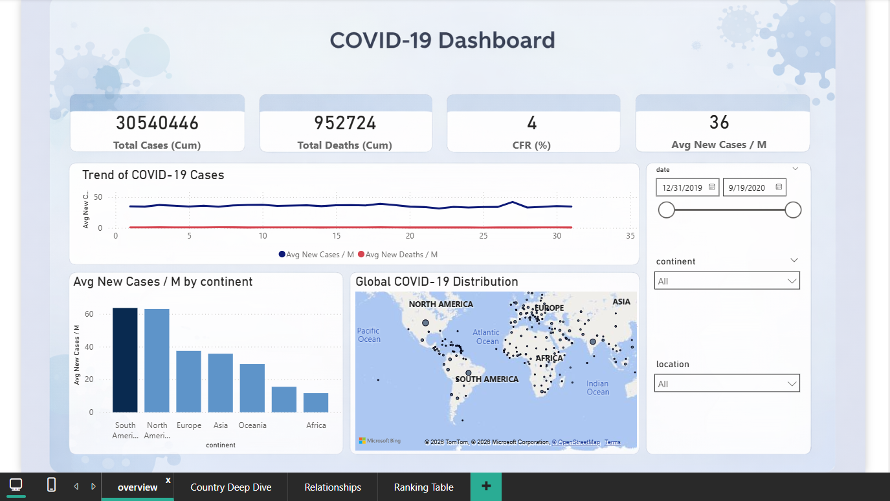
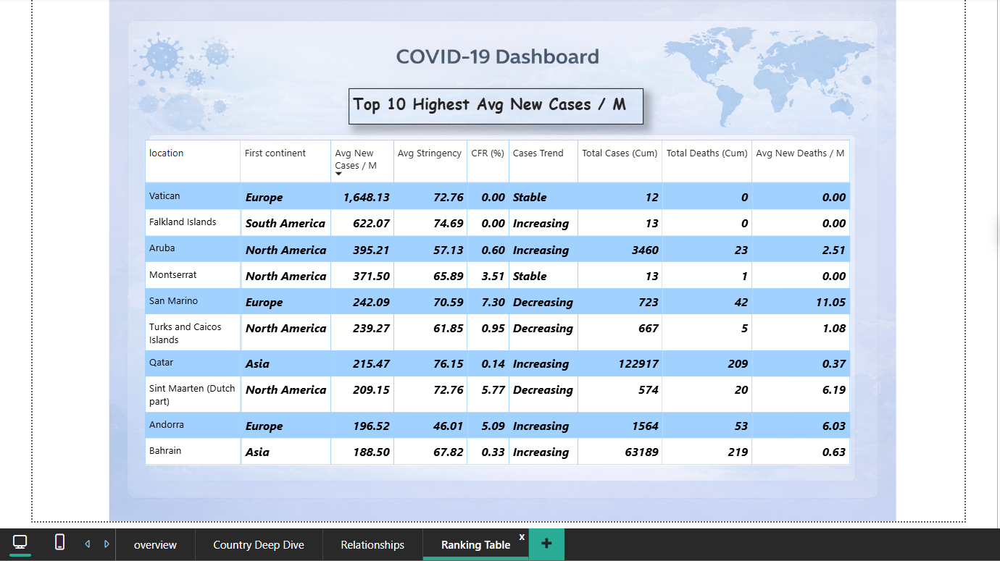

# 🌍 COVID-19 Global Analysis Dashboard (Power BI)

## 📌 Project Overview
This Power BI project provides a **comprehensive global analysis of the COVID-19 pandemic**, focusing on case trends, fatalities, government response, and cross-country comparisons.

The dashboard is designed to help users:
- Understand how the pandemic evolved over time.
- Compare countries and continents.
- Explore relationships between government policies and COVID-19 outcomes.
- Identify the most affected regions using data-driven insights.

---

## 🛠️ Tools & Technologies
- **Power BI**
- **DAX**
- **Data Modeling**
- **Interactive Dashboards**
- **Time Series Analysis**
- **Geospatial Visualization (Maps)**

---

## 📊 Dashboard Pages & Description

---

### 1️⃣ Overview Page

#### Content:
- Global KPIs:
  - Total Cases (Cumulative)
  - Total Deaths (Cumulative)
  - Case Fatality Rate (CFR %)
  - Average New Cases per Million
- Line chart showing **New Cases vs New Deaths over time**.
- Bar chart comparing **average new cases per million by continent**.
- World map displaying the **global distribution of COVID-19 cases**.
- Filters:
  - Date range (Dec 31, 2019 – Sep 19, 2020)
  - Continent
  - Location

#### Purpose:
Provides a **high-level snapshot** of the pandemic globally, highlighting major trends and regional differences.

---

### 2️⃣ Country Deep Dive Page

#### Content:
- Country selector for focused analysis.
- Country-level KPIs:
  - Total cases & deaths
  - Case Fatality Rate (CFR)
  - Average new cases & deaths per million
- Trend analysis for cases and deaths over time.
- Government Response:
  - Average Stringency Index.
- Comparisons:
  - Country vs Continent vs Global averages.

#### Purpose:
Enables **deep analysis of individual countries**, helping evaluate performance and policy effectiveness.

---

### 3️⃣ Relationships Page

#### Content:
- Bubble Chart 1:
  - Relationship between **government stringency and new cases per million**.
- Bubble Chart 2:
  - Relationship between **new cases and new deaths per million**.
- Bubble size represents severity metrics (e.g., CFR).
- Color-coded by continent.

#### Purpose:
Highlights **correlations and patterns** between policy measures, cases, and fatalities, and helps identify outliers.

---

### 4️⃣ Ranking Table Page

#### Content:
- Interactive ranking table including:
  - Country & Continent
  - Average New Cases per Million
  - Average Stringency Index
  - Case Fatality Rate (CFR %)
  - Case Trend (Increasing / Decreasing / Stable)
  - Total Cases & Deaths (Cumulative)
- Top 10 countries with highest average new cases per million.

#### Purpose:
Allows **quick comparison and ranking** of countries based on pandemic severity and response.

---

## 🔍 Key Insights
- Continents showed **significant variation** in average new cases per million.
- Some countries experienced **high fatality rates despite moderate case numbers**, indicating healthcare or policy challenges.
- Higher government stringency did not always correlate with lower case numbers, highlighting the complexity of pandemic control.
- Small countries and territories often appeared as **outliers** due to population size effects.

---

## 💡 Recommendations
- Combine **policy stringency** with healthcare capacity indicators for better outcome prediction.
- Normalize metrics by population to avoid misleading comparisons.
- Use trend-based indicators (not cumulative only) for early warning signals.
- Extend the analysis with vaccination and post-2020 data for longitudinal insights.

---

## 📂 Dataset Information
- Time period: **Dec 31, 2019 – Sep 19, 2020**
- Granularity: Daily, country-level data
- Metrics include cases, deaths, testing, and government response indicators.

---

## 🚀 How to Use
1. Download the `.pbix` file.
2. Open using **Power BI Desktop**.
3. Interact with filters, maps, and visuals to explore the data.

---

