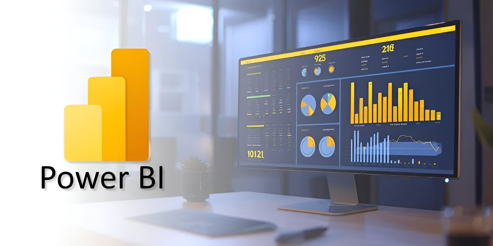

# 📊 Power BI Analytics Portfolio

A professional GitHub repository showcasing end-to-end Power BI projects focused on data analysis, visualization, and business insights.  
This repository is designed as a **portfolio** for recruiters, collaborators, and learners.

---

## 🎯 Purpose of This Repository

- Showcase **real-world Power BI projects**
- Demonstrate skills in:
  - Data modeling
  - DAX calculations
  - Power Query
  - Dashboard design
  - Business analysis
- Provide clear, well-documented case studies

---

## 📈 What This Portfolio Demonstrates

- End-to-end Power BI workflow (data → model → dashboard → insights)
- Strong understanding of business-oriented analytics
- Ability to communicate insights clearly through visuals
- Clean, structured, and maintainable project organization

---

## 🛠 Tools & Technologies

- Power BI Desktop  
- DAX  
- Power Query (M)  
- Excel / CSV datasets  
- SQL (where applicable)

---

## 📂 Projects Overview

Each folder inside the `projects` directory represents a **standalone Power BI project** and includes:

- Power BI `.pbix` file  
- Dataset (sample or anonymized)  
- Screenshots of dashboards  
- Detailed project README  
- Business insights and recommendations  

---

## 📂 Power BI Portfolio Projects

| Project Name | Business Domain | Description | Tools | Status |
|-------------|----------------|-------------|-------|--------|
| **Spotify Streaming Analysis** | Music Streaming Analytics | Analysis of streaming trends, top artists, popular songs, and user engagement metrics to uncover listening behavior patterns. | Power BI, DAX | ✅ Completed |
| **Covid-19 Global Analysis** | Healthcare Analytics | Global analysis of COVID-19 cases, deaths, and recovery trends across countries and regions. | Power BI, DAX | ✅ Completed |
| **Adidas Sales Dashboard** | Retail & Consumer Goods | Sales performance analysis for Adidas products focusing on revenue, regions, product categories, and profitability. | Power BI, DAX | ✅ Completed |
| **Retail-Sales-Performance-Q1-2019** | Retail & Sales Analytics | Evaluation of retail sales performance during Q1 2019 with insights into monthly trends and sales distribution. | Power BI, DAX | ✅ Completed |
| **Item-Sales-Performance-Analysis** | Sales & Operations Analytics | Item-level sales analysis highlighting total sales, quantity sold, profitability, and regional performance. | Power BI, DAX | ✅ Completed |

---

## 🚀 How to Use This Repository

1. Browse the `projects` folder.
2. Open any project folder to view:
   - Project README
   - Dashboard screenshots
   - Power BI `.pbix` file
3. Download the `.pbix` file to explore the dashboard interactively using Power BI Desktop.

---

## 🖼 Screenshots & Visuals

Each project includes a `screenshots` folder containing:

- Full dashboard overview
- Key report pages
- Filters or drill-down examples

Screenshots are embedded inside each project README for quick review.

---

## 👩‍💻 About Us

Aspiring Data Analysts with a strong focus on Power BI and data visualization.  
Passionate about transforming raw data into meaningful insights and clear business stories.

---

## 🤝 Collaboration

All projects in this repository were developed **in collaboration** by:

**Ibrahim Hamdy Ibrahim**  
**Zeinab Ahmed**  
- Email: *zeinb21ahmed@gmail.com* 
- GitHub: *https://github.com/ZeinbAhmed21*
- LinkedIn: *https://www.linkedin.com/in/zeinb-ahmed-343019357/?locale=en_US*

---

## 📬 Contact

- LinkedIn: *https://www.linkedin.com/in/ibrahim-hamdy-83a964292/*  
- Email: *ihamdy719@gmail.com*  

---

⭐ If you find this repository useful, feel free to star it!
