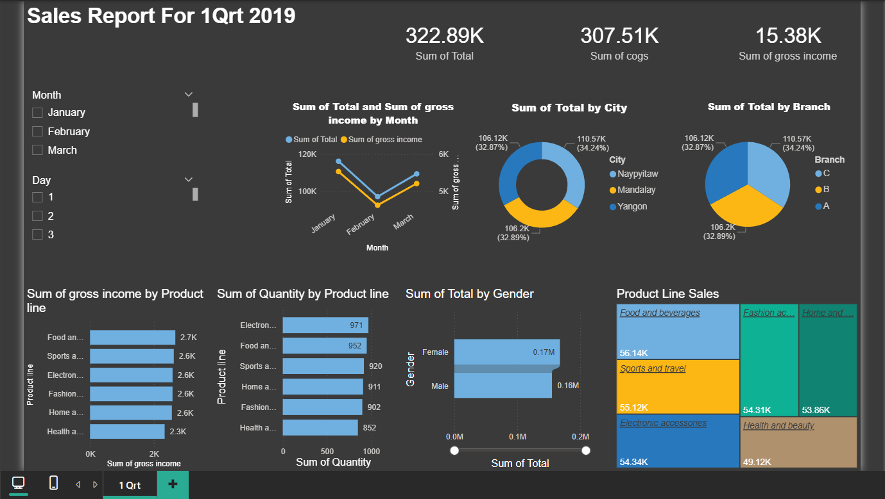

# 🛒 Retail Sales Performance – Q1 2019

## 📌 Project Overview

This Power BI project analyzes **retail sales data** for the **first quarter of 2019 (Q1)**.  
The dataset represents a **multi-branch retail business** operating across multiple cities, offering various product lines and serving different customer segments.

The dashboard is designed to provide a **clear financial and operational overview**, focusing on sales performance, cost structure, and profitability.

---

## 🎯 Project Objectives

- Analyze overall retail sales performance during Q1 2019
- Monitor key financial KPIs such as Total Sales, COGS, and Gross Income
- Compare performance across cities and branches
- Identify top-performing product lines
- Understand customer behavior by gender
- Enable time-based filtering at both monthly and daily levels

---

## 📊 Dashboard Overview

The dashboard consists of **one focused analytical page** summarizing retail performance for Q1 2019.

---

### 🔍 Filters

- **Month Selector:** January, February, March  
- **Day Selector:** 1, 2, 3  

These filters allow users to drill down into specific time periods within the quarter.

---

### 📈 Key Performance Indicators (KPIs)

Top-level KPIs provide a quick snapshot of financial performance:

- **Total Sales:** 322.89K  
- **Cost of Goods Sold (COGS):** 307.51K  
- **Gross Income:** 15.38K  

These metrics help evaluate overall profitability and cost efficiency.

---

### 📆 Monthly Sales & Profit Trend (Line Chart)

- Displays **Total Sales vs. Gross Income** by month
- Highlights monthly trends in revenue and profitability
- Helps identify peak and low-performing months

---

### 🍩 Sales Distribution (Donut Charts)

#### Sales by City
- Naypyitaw: 106.12K (32.87%)
- Mandalay: 106.20K (32.89%)
- Yangon: 110.57K (34.24%)

#### Sales by Branch
- Branch C: 106.12K (32.87%)
- Branch B: 106.20K (32.89%)
- Branch A: 110.57K (34.24%)

These visuals provide quick comparisons across retail locations.

---

### 📊 Product Line Analysis (Bar Charts)

#### Gross Income by Product Line
- Food and Beverages: 2.7K  
- Sports and Travel: 2.6K  
- Electronic Accessories: 2.6K  
- Fashion Accessories: 2.6K  
- Home and Lifestyle: 2.6K  
- Health and Beauty: 2.3K  

#### Quantity Sold by Product Line
- Electronic Accessories: 971  
- Food and Beverages: 952  
- Sports and Travel: 920  
- Home and Lifestyle: 911  
- Fashion Accessories: 902  
- Health and Beauty: 852  

These charts highlight both **sales volume** and **profit contribution**.

---

### 👥 Customer Segmentation (Gender)

- **Female:** 0.17M  
- **Male:** 0.16M  

Indicates a slightly higher contribution from female customers.

---

### 🌳 Product Line Sales Breakdown (Treemap)

Visual representation of total sales by product line:

- Food and Beverages: 56.14K  
- Sports and Travel: 55.12K  
- Electronic Accessories: 54.34K  
- Fashion Accessories: 54.31K  
- Home and Lifestyle: 53.86K  
- Health and Beauty: 49.12K  

Helps quickly identify top-performing retail categories.

---

## 🖼️ Dashboard Screenshot

Preview of the dashboard layout and visuals:

*(High-quality dashboard image is stored in the `assets/` folder)*

---

## 🧠 Insights & Recommendations

### 🔑 Key Insights
- Retail sales are fairly evenly distributed across cities and branches, with **Yangon and Branch A slightly leading**.
- Food and Beverages generate the highest total sales and gross income.
- Female customers contribute marginally more to total retail sales.
- Profit margins are relatively tight due to high COGS.

### 💡 Recommendations
- Improve cost control strategies to enhance gross income margins.
- Focus marketing and inventory planning on top-performing product lines.
- Leverage customer segmentation insights for targeted promotions.
- Use daily and monthly filters to detect short-term sales opportunities.

---

## 🛠 Skills & Techniques Demonstrated

- Retail sales KPI design and financial analysis
- DAX calculations for profitability metrics
- Interactive filtering (Month & Day)
- Product, location, and customer segmentation
- Power BI visualization best practices
- Business-focused dashboard storytelling

---

## 📂 Data Information

- Retail sales data for Q1 2019
- Includes time, product, customer, and location dimensions
- Data cleaned and transformed using **Power Query**
- Dataset used for analytical and educational purposes

---
