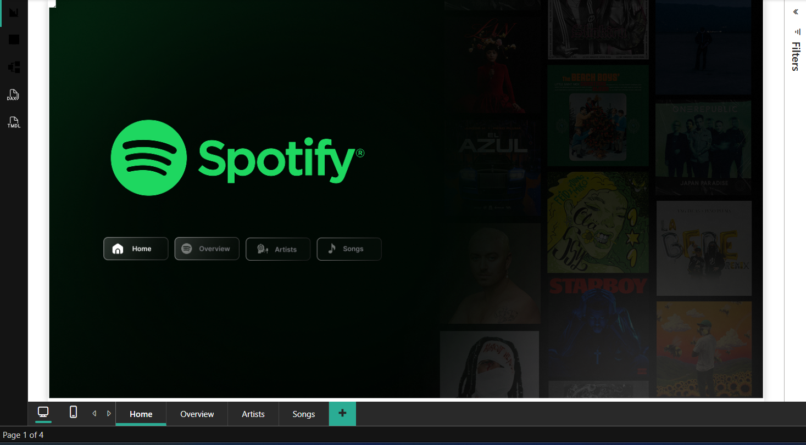
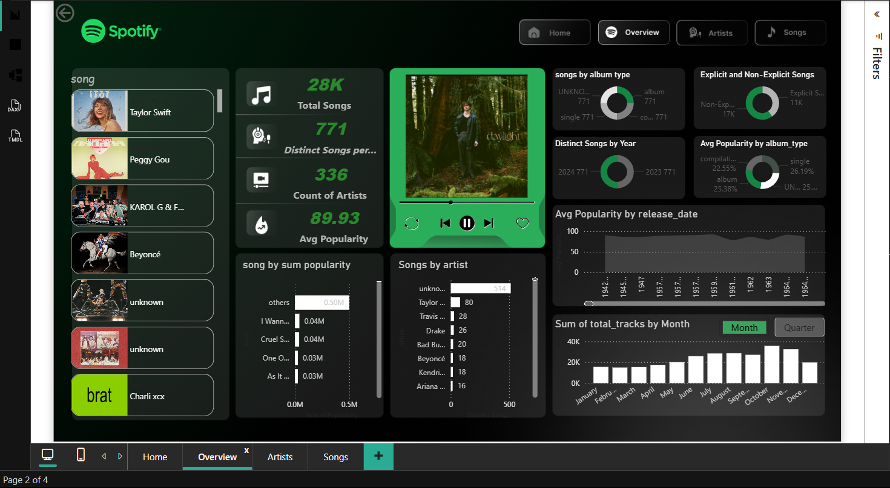
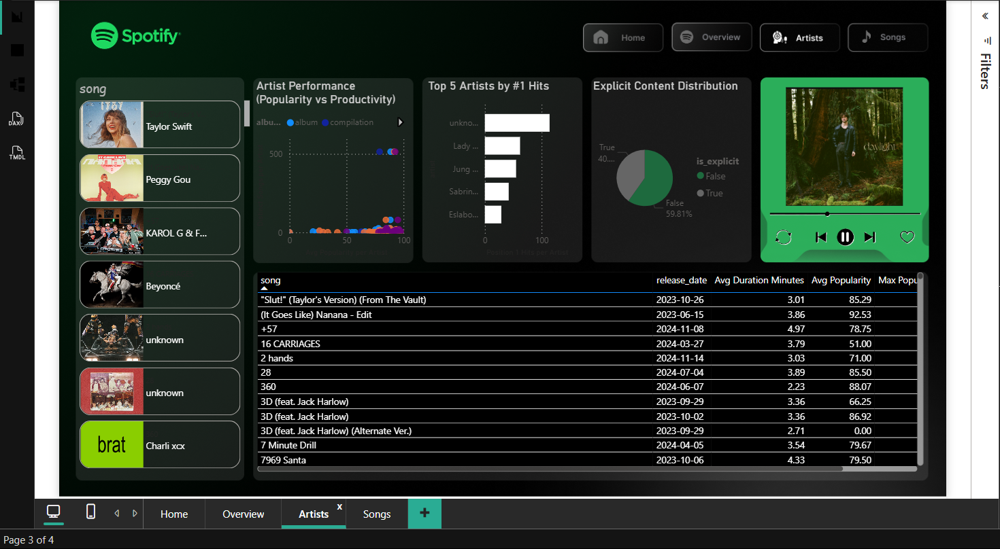
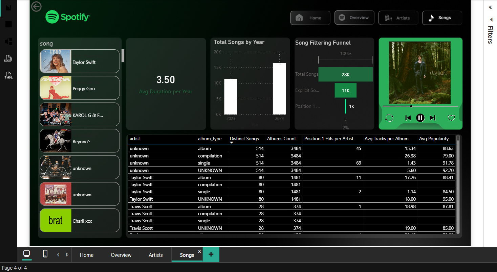

# 🎵 Spotify Streaming Analysis

## 📌 Project Overview

This Power BI project analyzes Spotify streaming data to uncover trends in music popularity, artist performance, and song characteristics.  
The dashboard is designed to provide **clear, business-oriented insights** through interactive visuals and filtering capabilities.

This project represents an **end-to-end analytics workflow**, from raw data exploration to insight-driven dashboard design.

---

## 🎯 Project Objectives

* Analyze overall music streaming performance
* Identify top-performing artists and songs
* Explore trends across years, album types, and release dates
* Compare explicit vs non-explicit content
* Enable interactive filtering for deeper exploration

---

## 📊 Dashboard Overview

The dashboard is divided into **four interactive pages**, each focusing on a specific analytical perspective:

---

### 🏠 Home Page

The home page serves as the main navigation layer, allowing users to move easily between different analytical views and dashboard sections.

---

### 1️⃣ Overview Page

Provides a high-level summary of the dataset:

* **Total Songs:** 28K
* **Distinct Songs per Artist**
* **Count of Artists:** 336
* **Average Popularity:** 89.93
* Distribution by **Album Type** (Album, Single, Compilation)
* **Explicit vs Non-Explicit** songs comparison

This page helps stakeholders quickly understand the overall landscape of the dataset.

---

### 2️⃣ Artist Insights

Focuses on artist-level performance and productivity:

* Songs by Artist (e.g., Taylor Swift, Beyoncé, Drake, Charli XCX)
* Top Artists by **#1 Hits**
* Artist Performance Analysis: **Popularity vs Productivity**
* **Average Tracks per Album**
* **Average Popularity per Artist**

This page highlights how artist output relates to popularity and success.

---

### 3️⃣ Song-Level Analysis

Provides deeper insights at the individual song level:

* Song Popularity by Artist
* Distinct Songs by Year (2023, 2024)
* Average Popularity by Album Type
* Average Popularity by Release Date
* Total Tracks by Month

This section helps identify seasonal trends and release strategies.

---

## 🧠 Skills & Techniques Demonstrated

* Data modeling in Power BI
* DAX measures and calculated columns
* Power Query data transformation
* Interactive dashboard design
* Funnel analysis and filtering logic
* Business-focused storytelling through data

---

## 📂 Data Information

* Dataset: Spotify streaming data
* Format: CSV / Excel
* Data has been cleaned and prepared using **Power Query**
* Dataset is used for analytical and educational purposes

---

## 🚀 How to Explore the Project

1. Open the `.pbix` file using Power BI Desktop
2. Navigate through dashboard pages using tabs
3. Apply filters and slicers for deeper insights
4. Review visuals directly in this README for a quick overview

---
